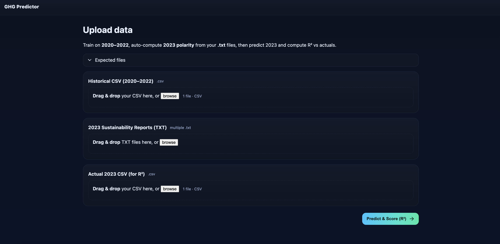
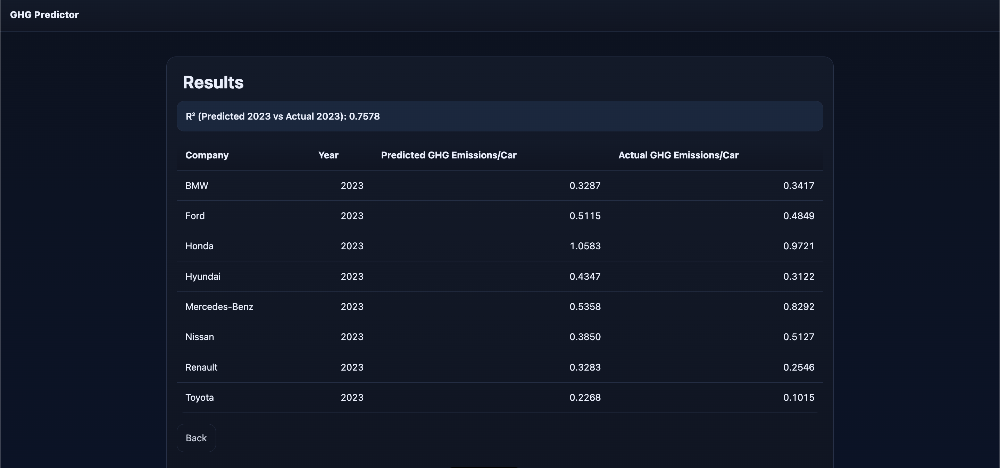

# GHGPredictor

This model predicts **GHG Emissions per Vehicle** for multiple vehicle companies by combining:
- **Historical data from 2020–2022**, and
- ** Uses OpenAI GPT-4o mini for sentiment analysis on extracted text from company sustainability reports (.txt)**

The app also computes **R²** to quantify how well predictions align with the **actual 2023** GHG/vehicle values.

---

## Quick start

```bash
# clone & enter
git clone https://github.com/<your-username>/GHGPredictor.git
cd GHGPredictor

# virtual env
python3 -m venv .venv
source .venv/bin/activate     # Windows: .venv\Scripts\activate

# install deps
python -m pip install --upgrade pip
pip install -r requirements.txt

# run
python app.py

```

### App URL

- [http://127.0.0.1:5000/](http://127.0.0.1:5000/) 

### Inputs

- Historical CSV with columns: Company, Year, GHG Emissions/Car, Total GHG Emissions, Net Income (Billions), Invested Money (Billions), and Total Polarity
- 2023 Sustainability Report .txt file (must contain company name in file name)
- Actual 2023 data CSV for computing **R²** values

### Website Interface




